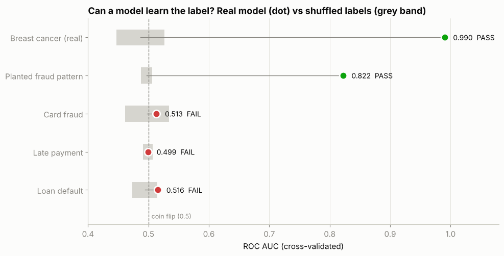
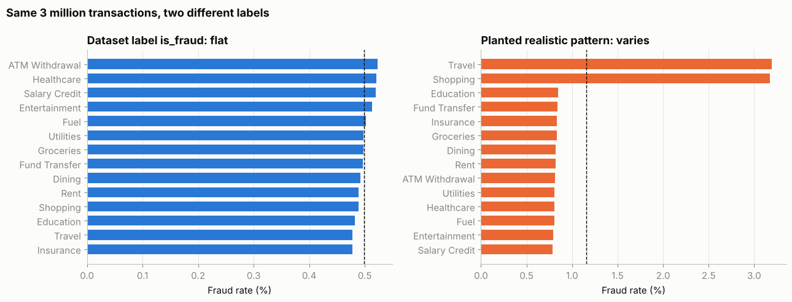
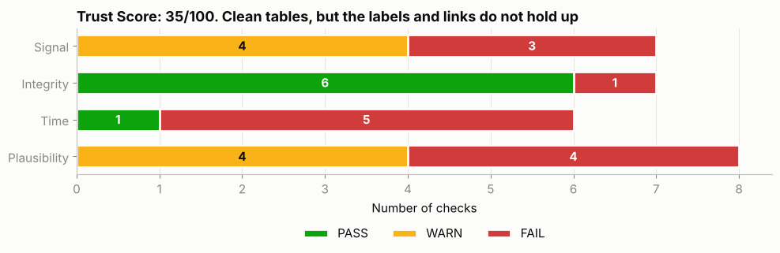

# 🕵️ Dataset Lie Detector

**Find out in minutes whether a dataset can be trusted for machine learning, before you spend days modelling it.**

Many datasets online look clean: no missing values, tidy columns, thousands of downloads. But clean is not the same as *learnable*. If the labels were assigned at random, or the tables do not really connect, every model you build will learn nothing, and some will still report impressive-looking accuracy.

`LieDetector` is a small, dependency-light Python class that checks four things and rolls them into a single **Trust Score out of 100**.

| Check | Question it answers |
|---|---|
| **Signal** | Can a model learn the label at all, or is it no better than shuffled labels? |
| **Integrity** | Do IDs point to real records, and do linked records agree? |
| **Time** | Do events happen in a possible order? |
| **Plausibility** | Do real-world rules and expected relationships hold? |



## Quick start

```python
from lie_detector import LieDetector

ld = LieDetector("My dataset")
ld.label_signal(df, target="churn")                                  # 1. Is there signal?
ld.foreign_key(orders, "customer_id", customers)                     # 2. Do tables link?
ld.date_order("Shipped after ordered", df.order_date, df.ship_date)  # 3. Does time make sense?
ld.rule("No negative prices", df.price < 0)                          # 4. Do rules hold?

print(ld.summary())
ld.report()
```

## How the signal test works

1. Train a gradient-boosted model on the real labels and measure cross-validated ROC AUC.
2. Shuffle the labels randomly and train the same model again, several times. This shows what pure luck looks like.
3. If the real model is not clearly better than the shuffled ones, the labels carry no learnable pattern.

This is a **permutation test**. It does not depend on the model being well tuned: if even a flexible model cannot beat shuffled labels, the problem is the data.

The detector is validated with **positive controls**, so it is not simply pessimistic: it scores AUC 0.99 (PASS) on scikit-learn's breast cancer data and 0.82 (PASS) on a realistic fraud pattern planted into real transactions.

## Case study: a 5.9 million row banking dataset

The notebook runs the full audit on the [Banking Transactions Dataset](https://www.kaggle.com/datasets/vivekmali1436/banking-transactions-dataset) on Kaggle (10 tables, zero missing values).

| Finding | Result |
|---|---|
| Fraud, late payment and default labels | AUC 0.50 to 0.52, same as shuffled labels |
| Cards linked to an account owned by someone else | over 99.99% |
| Loan payments made before the loan started | 46.7% |
| Card transactions before the card was issued | 31.0% |
| Customers who joined the bank as children | 14.0% |
| **Trust Score** | **35 / 100** |



The dataset is described by its creator as built for SQL, Python and Power BI practice, and it is well suited to that. The audit shows it should not be used to train or evaluate ML models.



## Files

| File | What it is |
|---|---|
| `lie_detector.py` | The toolkit (single file, copy it into any project) |
| `notebook.ipynb` | Full case study with outputs, also published on Kaggle |
| `build_notebook.py` | Regenerates the notebook from source |
| `images/` | Charts used in this README |

## Install

```bash
pip install -r requirements.txt
```

Requires Python 3.9+, pandas, numpy, scipy, scikit-learn and matplotlib (all preinstalled on Kaggle and Colab).

## Limitations

- `label_signal` supports **binary** targets. Multiclass and regression are on the roadmap.
- A FAIL means "no signal with these features". If the true drivers of a label are missing from the data, the test cannot see them. That is still worth knowing before you model.
- Thresholds (for example 0.1% warn and 5% fail for rule breaks) are sensible defaults, not universal truths. Adjust them for your domain.

## Roadmap

- Multiclass and regression signal tests
- Leakage detector (features that are suspiciously too predictive)
- Train/test distribution drift check
- One-line HTML report

Contributions and ideas for new checks are welcome. Open an issue or a pull request.

## Author

**Collins Lemeke**, AI researcher and engineer
[GitHub](https://github.com/CollinsLemeke) · [Kaggle](https://www.kaggle.com/collinslemeke) · [Hugging Face](https://huggingface.co/Lemeke)

## License

MIT
